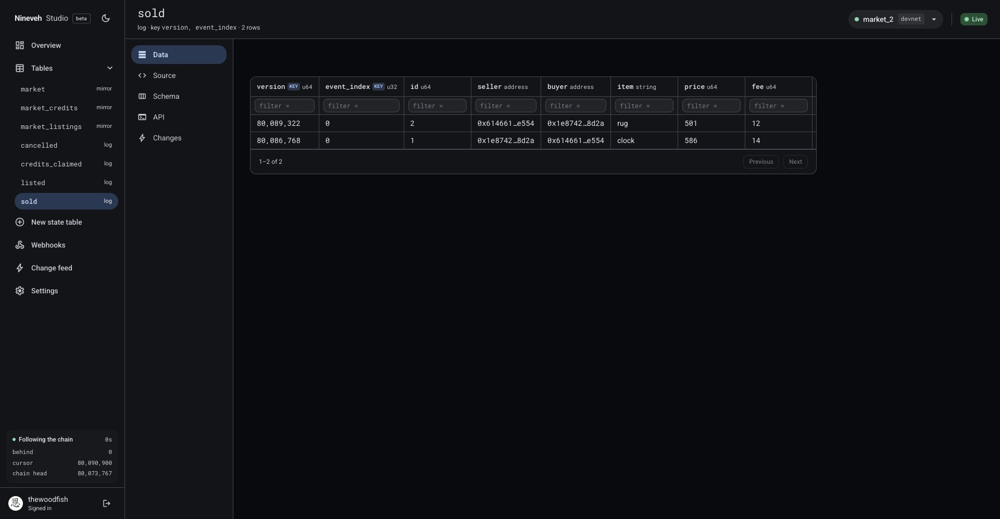
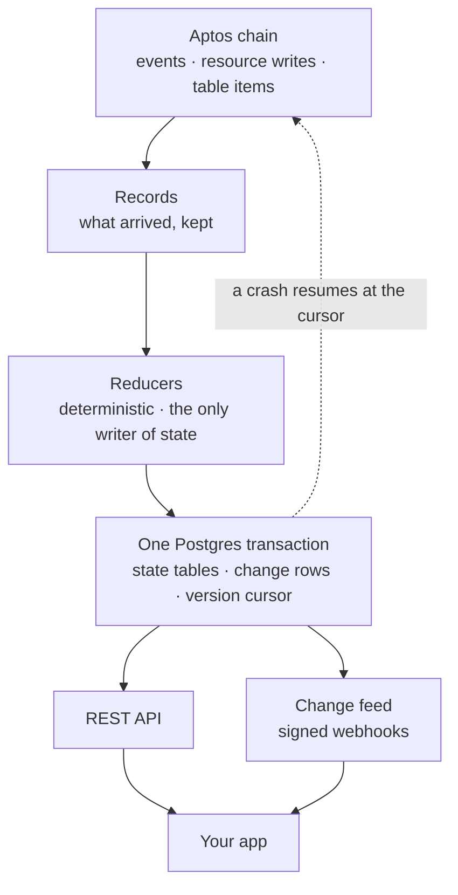

# Nineveh

The backend for Aptos applications.

Point Nineveh at your contract and describe the state you want. You get a live,
queryable database with real-time subscriptions, kept continuously in sync with the
chain, and no indexing infrastructure to run.

Aptos answers point reads: one resource at one address, one view function, one table
item by key. *How much volume did this market do today*, *show me every open position*
and *what changed since I last looked* have nowhere to come from.

Half the answer is in events. The other half was never emitted at all — a contract
keeps the state it needs to work and announces only what it expected you to want, so
the `SmartTable` of open listings and the tally nobody fired an event for exist only as
storage writes. Nineveh follows both, reading the write set rather than the
announcements ([the longer version](docs/guide.md#2-why-this-exists)).

> **Status: beta, and live at [nineveh.dev](https://nineveh.dev).** A contract address
> in; live tables, a REST API, a change feed and signed webhooks out, driven from a
> browser dashboard. Testnet and devnet for now. See
> [What Nineveh is not](docs/guide.md#5-what-nineveh-is-not) before you plan around it.

## Start

Open [studio.nineveh.dev](https://studio.nineveh.dev), sign in with GitHub, and paste a
contract address. Nineveh reads the contract off the chain, lists the events, resources
and tables it could follow, and builds a backend from the ones you tick — live rows in a
couple of seconds, with nothing installed and nothing to operate.



Every table it builds is a REST endpoint, a change feed and a webhook target from the
moment it exists:

```sh
curl -H "Authorization: Bearer nvk_…" \
  "https://api.nineveh.dev/projects/market/v1/tables/sold?limit=1&order=price.desc"
```

```json
{
  "rows": [
    {
      "version": "80086768", "event_index": 0,
      "id": "1", "seller": "0x1e8742…8d2a", "buyer": "0x614661…e554",
      "item": "clock", "price": "586", "fee": "14",
      "_version": "80086768"
    }
  ],
  "limit": 1, "offset": 0, "count": null
}
```

Wide integers come back as strings, because a Move `u64` doesn't fit a JavaScript
number. The same rows arrive as they commit, over Server-Sent Events:

```sh
curl -N -H "Authorization: Bearer nvk_…" \
  "https://api.nineveh.dev/projects/market/v1/changes"
```

```text
event: change
id: 80089322.0
data: {"version":"80089322","seq":0,"table":"sold","op":"insert","key":{"version":"80089322","event_index":0},"row":{…}}
```

**[Your first backend](docs/first-backend.md)** walks the whole path with a contract you
publish yourself, and [`examples/`](examples/) has four to try it on.

Nineveh is Apache-2.0 and runs on your own machine, which is a supported path rather
than the main one: [Running Nineveh yourself](SELF_HOSTED.md).

Questions, or something behaving oddly? [Telegram](https://t.me/+kVwq6suLvZNlNGE0).

## How it works

Nineveh is event sourcing with materialized read models:



- **The chain is the source of truth.** Nineveh reads its events, resource changes and
  table items from the Aptos Transaction Stream.
- **Reducers fold them into state tables.** Reducers are deterministic, replayable and
  the only writer of state.
- **Your app queries state and subscribes to changes.** It never reads the raw log.

State, change notifications and the processing cursor commit in one Postgres
transaction. A crash anywhere resumes exactly where it left off, and a replay rebuilds
exactly the same state.

## Documentation

Written as markdown in this repo, and built into a site by `site/`:

- [`docs/guide.md`](docs/guide.md) — **start here**: what it is and the one idea.
- [`docs/first-backend.md`](docs/first-backend.md) — a working project, end to end.
- [`docs/reducers.md`](docs/reducers.md) — the language your tables are written in.
- [`docs/reading.md`](docs/reading.md) — REST, the change feed, webhooks.
- [`docs/running.md`](docs/running.md) — changes, limits, and what to check.
- [`docs/config.md`](docs/config.md) — every key in `nineveh.yaml`, the file Studio
  writes for you.
- [`docs/expressions.md`](docs/expressions.md) — the expression language.

For running it yourself: [`SELF_HOSTED.md`](SELF_HOSTED.md).
For changing it: [`CLAUDE.md`](CLAUDE.md), [`docs/adr/`](docs/adr/) for why each
decision was made, and [`docs/research/`](docs/research/) for what the Transaction
Stream actually costs.

## Development

You need a Rust toolchain; `rust-toolchain.toml` pins the version, and `rustup`
installs it on first use.

```sh
cargo test --workspace                  # unit tests
cargo clippy --workspace --all-targets  # lints (CI runs with -D warnings)
cargo xtask codegen --check             # generated gRPC bindings are current
scripts/check-deps.sh                   # crate dependency direction
scripts/check.sh                        # everything CI runs, in one pass
```

The store and pipeline tests need Postgres and **skip silently without it** — a green
`cargo test` that never touched a database is the usual surprise:

```sh
createdb nineveh_test
NINEVEH_TEST_DATABASE_URL=postgres:///nineveh_test cargo test --workspace
```

Set that one, not `DATABASE_URL`: `DATABASE_URL` switches sqlx's macros to checking
against a live database instead of the committed query cache.

To drive your own build the way Studio does — the control plane, and the dashboard
against it:

```sh
cargo build --release -p nineveh-cli          # the binary: target/release/nineveh
createdb nineveh
export APTOS_API_KEY_TESTNET=aptoslabs_...    # https://geomi.dev
export NINEVEH_DATABASE_URL=postgres:///nineveh

target/release/nineveh up --streams 1         # the control plane, on :4000
cd studio && npm install && npm run dev       # the dashboard, on :3000
```

Talking to the live Transaction Stream needs a [Geomi](https://geomi.dev) API key:

```sh
export APTOS_API_KEY=aptoslabs_...
cargo run --release -p nineveh-ingest --example stream_probe -- \
    --network testnet --start <version> --count 10000
```

See [CONTRIBUTING.md](CONTRIBUTING.md) for how changes are made.

## License

Apache-2.0. See [LICENSE](LICENSE).
