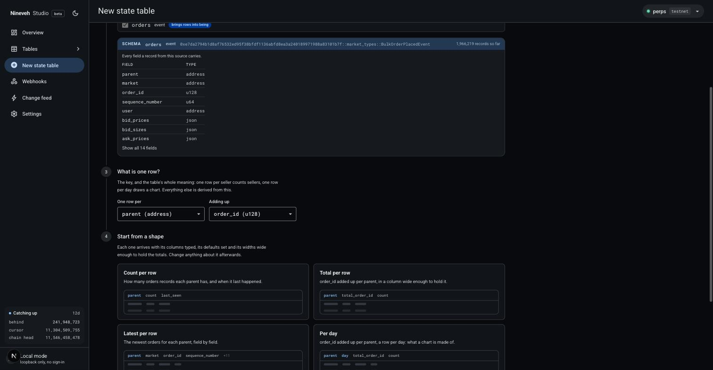
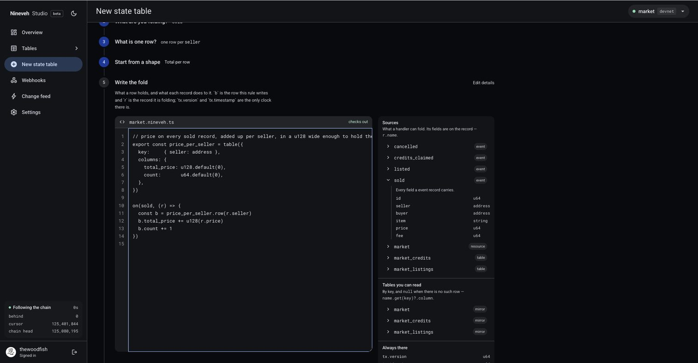

# Your first backend

Point Nineveh at a contract, send it transactions from a browser tab, and watch them
turn into tables you can query. Follow it top to bottom; every step produces something
you can see, and the whole thing runs without installing anything.

You need a GitHub account. Nothing else: no toolchain, no wallet, and no key to Aptos —
Nineveh holds its own credentials for the chain, and the one key you will ever handle is
[your project's own](reading.md#1-rest), for reading what it builds.

## 1. Find a contract to follow

The interesting thing about a backend is what happens when the chain moves, so you want
a contract you can make move on demand. Open **[nineveh.dev/play](https://nineveh.dev/play)**
and leave the tab open: it holds a marketplace contract on devnet, and buttons that send
it real transactions. You will use it again in §3.

Copy the address it shows. That is what you are about to follow.

`market` is a small marketplace. Sellers list an item for a price in the market's own
credits, buyers buy it, sellers take down what doesn't sell, and the market keeps 2.5% of
every sale. Open listings live in a `SmartTable` and balances in a `Table`, which matters
later. It is
[two hundred lines of Move](https://github.com/thewoodfish/Nineveh/blob/main/examples/03-market/sources/market.move)
and you don't have to read any of them yet.

That address is stable. It changes only when devnet is wiped, about weekly, which takes
every contract on it with it — and then the page shows the new one.

Other people are driving the same contract, so some of the rows you see will be theirs.
That is a fair picture of what following any live contract looks like, and §7 covers
pointing Nineveh at one of your own, where every row is yours.

## 2. Create the project

Open Studio at <https://studio.nineveh.dev> and sign in with GitHub.

**New project** → network **devnet** → paste the address → **Inspect**.

Nineveh reads the contract off the chain and lists everything it could follow: the
events it emits, the resources it stores, and the tables inside those resources. The
market is small enough to see all of it at once. Tick four things.

Under **Events**:

- `Listed`: someone put an item up for sale.
- `Sold`: someone bought one.
- `Cancelled`: a seller took theirs down.

Under **Tables**:

- `Market.listings`: what is for sale right now.

That last one is not an event, and it is the interesting one. Keep reading in §3 to see
why it behaves differently from the other three.

Name the project `market` and choose **From now on**.

That is the opposite of what you want for a contract of your own, and it is worth knowing
why it is right here. A free project starts within six hours of the chain's tip, and the
demo contract has been there longer — it stays at one address so that projects following
it don't go quiet every time it is replaced. Starting from now costs you its past, which
for a shared toy is no loss.

It costs you nothing else, because a `table:` source does not need the write that
*created* its table — it needs any write to the resource holding it. `Market.listings`
lives in the `Market` resource, and every listing, sale and cancellation writes that
resource. So one click in §3 is enough to tell Nineveh which tables are yours, and from
then on they fill like everything else.

**Create backend with 4 tables.**

## 3. Make something happen

The Overview shows a cursor climbing, the chain head it's chasing, and the gap between
them. Within a few seconds it reads *following the chain*.

And the tables may well be empty, which is correct: a table has nothing in it until
something happens on chain.

So make something happen. Back in the **[play](https://nineveh.dev/play)** tab:

**Fund the two accounts**, once. Two throwaway accounts live in that tab — one sells, one
buys, because the contract won't let you buy your own listing — and the devnet faucet
tops them up. Then **List and sell something**, as many times as you like. Each click
claims credits, lists an item and buys it: three transactions, three records.

Put the two tabs side by side. Rows arrive in the order the chain commits them, a couple
of seconds behind the click. Watch two tables in particular:

- **`sold`** only grows. It is a log: one row per sale, kept forever, in order.
- **`market_listings`** grows *and shrinks*. A row appears when something is listed and
  disappears when it sells or is cancelled.

You could have worked that out from the events alone: fold `Listed`, then take away
everything `Sold` and `Cancelled` mention. The mirror doesn't have to. The contract
removed the entry from its own `SmartTable`, and that removal is itself a record Nineveh
followed, so the table knows what is open without anyone deriving it.

That is why resources and tables are sources in their own right and not a second-class
thing. Events tell you what happened; resources and tables tell you what is true now.
Which of the two carries the state you need is the contract author's decision, not yours,
and because on-chain storage costs gas, plenty of contracts keep their real state in
resources and barely emit events at all. Following only events would leave you guessing
at those.

You now have a backend. It has a URL:

```text
https://api.nineveh.dev/projects/market
```

## 4. Query it

Your tables are yours: every read needs a key, and a key opens one project. Make one in
Studio under **Settings → API keys**, and keep it — it is shown once.

```sh
BASE=https://api.nineveh.dev/projects/market
AUTH="Authorization: Bearer nvk_…"         # Settings → API keys

curl -H "$AUTH" $BASE/v1/tables            # what tables exist, and their columns
curl -H "$AUTH" "$BASE/v1/tables/sold?limit=3"
```

Then something more specific: the ten priciest sales, dearest first.

```sh
curl -H "$AUTH" "$BASE/v1/tables/sold?limit=10&order=price.desc"
```

Look closely at `price` in the response:

```json
{ "id": "412", "seller": "0x9f3a…", "item": "kettle", "price": "640", "fee": "16" }
```

It's a **string**, not a number. `price` is a Move `u64`, which goes up to 18
quintillion, and JavaScript numbers stop being exact at 2⁵³. Nineveh returns wide
integers as strings so nothing is silently rounded, which means in your app:

```js
const price = BigInt(row.price)   // right
const price = Number(row.price)   // wrong above 9 quadrillion, silently
```

The market's prices are small enough to get away with it. A contract that moves real
amounts is not, and the type is the same either way.

## 5. Watch changes arrive

In a third terminal:

```sh
curl -N -H "$AUTH" "$BASE/v1/changes"
```

Every row change is pushed as it commits. Click **List and sell something** again with
this running and you are watching your own transactions come back to you:

```text
event: change
id: 11292175483.0
data: {"version":"11292175483","table":"sold","op":"insert","key":{…},"row":{…}}
```

Kill it, wait a moment, then resume from where you stopped:

```sh
curl -N -H "$AUTH" "$BASE/v1/changes?after=11292175483.0"
```

Nothing is missed. That `id` is how a browser resumes too: `EventSource` sends it
automatically as `Last-Event-ID`.

## 6. Build the table the contract doesn't have

Every table so far is a copy of something the chain already had: a log of records as
they arrived, or a mirror of what a table holds right now. That is useful, but it isn't
what a marketplace's front page needs. That needs *who sells the most*, and no amount of
querying a log of sales gives you a row per seller.

The contract can't tell you either. It knows a sale happened and then forgets. Keeping a
running total per seller would mean an extra write on every trade, and writes cost gas,
so almost no contract keeps one. The information is all there in the events you are
already following. Nobody has added it up.

That is what a reducer is for. In Studio, **New state table**. It asks four short
questions before it shows you any code:

1. **What will you call it?** — already filled in, and it keeps up with your answers
   below until you type over it.
2. **What are you folding?** — tick `sold`. You can tick more than one source; a table
   that goes up on one event and down on another needs two. One table here, so one tick.
3. **What is one row?** — **one row per** `seller`, **adding up** `price`.
4. **Start from a shape** — pick **Total per row**.



Studio writes it as a reducer you can read:

```ts
// price on every sold record, added up per seller, in a u128 wide enough to hold the total.
export const price_per_seller = table({
  key:     { seller: address },
  columns: {
    total_price: u128.default(0),
    count:       u64.default(0),
  },
})

on(sold, (r) => {
  const b = price_per_seller.row(r.seller)
  b.total_price += u128(r.price)
  b.count += 1
})
```

Read it before saving it. `sold` is the source you ticked in §2. The handler says what
one sale does: find that seller's row, add the price to a running total, count the sale.
`u128` because a `u64` column adding up `u64` prices overflows eventually, and overflow
halts a project rather than wrapping quietly.

Everything below the questions is yours to change — the file is the table now, and the
questions above it are only what it started from.



It is also not quite right. `total_price` is what buyers paid, and the market keeps 2.5%
of that, so it isn't what the seller got. Studio had no way to know: the fee is sitting
right there in the event next to the price, and only you know what it means. Change
three lines.

```ts
export const sellers = table({
  key:     { seller: address },
  columns: {
    sold:    u64.default(0),
    revenue: u128.default(0),
  },
})

on(sold, (s) => {
  const b = sellers.row(s.seller)
  b.sold    += 1
  b.revenue += u128(s.price - s.fee)
})
```

That gap is the whole reason reducers exist. Anything can hand you the records. The
number your product actually shows is usually one piece of arithmetic away from them,
and that piece is yours.

Save it. Nineveh rebuilds the new table from the records it already has, without
re-reading the chain, and the old table answers reads throughout, frozen where it had
reached until the new one swaps in. This project holds minutes of history, so that takes
seconds:

```sh
curl -H "$AUTH" "$BASE/v1/tables/sellers?order=revenue.desc&limit=5"
```

That block is the whole of [Reducers](reducers.md), and it is where the rest of your
time goes. The market's finished version, with a `buyers` table beside this one, is
[`market.nineveh.ts`](https://github.com/thewoodfish/Nineveh/blob/main/examples/03-market/market.nineveh.ts)
in the repo.

## 7. Now point it at your own contract

You have already done every step: paste an address, tick what to follow, fold it into
the table you want. Your own contract is the same five minutes again, with three things
to know that the demo didn't teach you.

**Owning both ends is worth it.** On the demo contract some of the rows were other
people's, and when you are learning that is fine. When you are checking your own work it
is not: you cannot tell a mistake of yours from a quiet afternoon on chain. Publish
something you control and drive it yourself. The four
[example contracts](https://github.com/thewoodfish/Nineveh/blob/main/examples/README.md)
are there to be published that way — that is the one part of this that needs the
[Aptos CLI](https://aptos.dev/tools/aptos-cli/) and a free [Geomi](https://geomi.dev)
key, because now you are the one sending transactions rather than a page we run.

**A source that matches nothing is not an error.** If you tick a type that never
arrives, you get a project that runs perfectly and stays empty. Nothing fails and
nothing complains, because that is also what a contract nobody is using looks like.
Studio tells you once it has read far enough to be sure: *"this source hasn't matched
anything yet"*. Until then, check the type name twice. Near-identical names in one
module are the commonest way to lose a morning.

**History is the expensive axis, not tables.** You chose **From now on** in §2 and gave
up nothing that mattered. For a contract of your own the choice is real: following a
contract that has been live for months means Nineveh reads every version of the chain in
the range, not just yours.

On the free tier it isn't a cost but a wall: a project starts within six hours of the
chain's tip, and asking for more is refused before anything is created — *"The Free tier
starts a project within 6 hours of the chain's tip."* Deep backfill holds one of a few
shared catch-up streams for hours, which is the scarce thing ([limits](running.md#3-limits)).

So **All of its history** is for a contract you published minutes ago, which is the usual
case when you are building. Past that window, start from now and know what you are
trading away: the past of your event and log tables. Your mirror and table sources catch
up as soon as the resources behind them are written again — which, on a contract anybody
is using, is immediately.

**A quiet contract looks exactly like a broken one.** Make it busy before you judge what
you built.
[`play.sh`](https://github.com/thewoodfish/Nineveh/blob/main/examples/play.sh) in the
examples does nothing cleverer than sending transactions in a loop; it is under a hundred
lines and most of them are picking what to send.

## 8. What you just learned

- A **source** is chain data you follow: events, resources, and the tables inside them.
  A **state table** is what you build from it.
- Events say what happened; resources and tables say what is true now. `market_listings`
  shrinking is the difference, and most contracts need you to follow both.
- A **log** table keeps every record; a **reduce** table folds them into something
  smaller and more useful. The useful one is almost always a number the contract itself
  never stores, because storing it would have cost gas.
- Changing a reducer replays your stored records rather than the chain: minutes for a
  project with real history, not another backfill. Adding a *source* is the expensive
  one, because no history exists for something you never followed.
- Wide integers are strings. Parse them as `BigInt`.

Next: **[Reducers](reducers.md)**, to write the fold yourself rather than starting from
a template.
