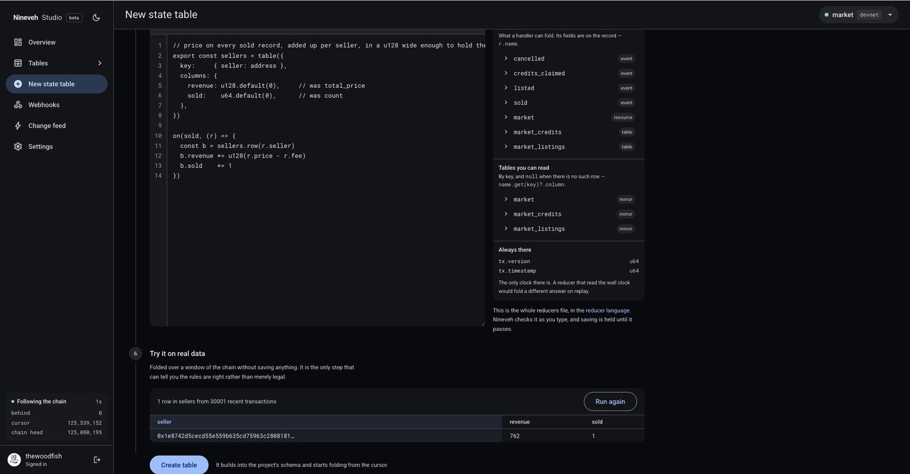

# Your first backend

Publish a contract, point Nineveh at it, send it transactions, and watch them turn into
tables you can query. Follow it top to bottom; every step produces something you can
see.

You need the [Aptos CLI](https://aptos.dev/tools/aptos-cli/) (`brew install aptos`) and
a GitHub account for Studio. No node key: devnet answers the CLI anonymously, and
Nineveh holds its own credentials for the chain, so the only key in this whole page is
[your project's own](reading.md#1-rest), for reading what it builds.

## 1. Publish a contract to follow

A backend is only interesting once the chain moves, and the quickest way to have a
contract that moves when you say so is to publish one you control.

`market` is a small marketplace. Sellers list an item for a price in the market's own
credits, buyers buy it, sellers take down what doesn't sell, and the market keeps 2.5% of
every sale. Open listings live in a `SmartTable` and balances in a `Table`, which matters
in §3. It is
[two hundred lines of Move](https://github.com/thewoodfish/Nineveh/blob/main/examples/03-market/sources/market.move)
and you don't have to read any of them yet.

```sh
git clone https://github.com/thewoodfish/Nineveh
cd Nineveh/examples

NETWORK=devnet ./setup.sh              # two accounts, funded from the devnet faucet
NETWORK=devnet ./deploy.sh 03-market   # publishes it at an object address
```

Under a minute, and nothing asked you for a key: devnet's faucet and fullnode both
answer anonymously. §3 says where that stops being true.

Two accounts because `buy` asserts the buyer is not the seller: `nineveh-publisher-devnet`
publishes the contract and sells in it, `nineveh-player-devnet` buys. Their keys live in
`examples/.aptos/config.yaml`, which git ignores.

Devnet because its faucet funds accounts over its API, so none of this needs a browser.
`NETWORK=testnet` works the same way except you fund the two accounts through the faucet
page `setup.sh` prints. Devnet is wiped about weekly, which §7 comes back to.

`deploy.sh` writes the address it published to:

```sh
source deployed.devnet.env && echo $MARKET
```

That address is yours. Nothing in this tutorial is shared with anyone, so every row you
see from here on is a transaction you sent — which is the whole reason to publish it
rather than follow someone else's.

## 2. Create the project

Open Studio at <https://studio.nineveh.dev> and sign in with GitHub.

**New project** → network **devnet** → paste the address → **Inspect**.

Nineveh reads the contract off the chain and lists everything it could follow: the
events it emits, the resources it stores, and the tables inside those resources. The
market is small enough to see all of it at once. Tick four things.

Under **Events**:

- `Listed`: someone put an item up for sale.
- `Sold`: someone bought one.
- `Cancelled`: a seller took theirs down.

Under **Tables**:

- `Market.listings`: what is for sale right now.

That last one is not an event, and it is the interesting one. Keep reading in §3 to see
why it behaves differently from the other three.

Name the project `market`. Choose **All of its history** — you published this minutes
ago, so there is nothing to catch up on, and starting at the beginning means a table
source sees the write that created its table with nothing to think about. The free tier
starts a project within six hours of the chain's tip ([limits](running.md#3-limits)),
which is the whole of a contract you just published and none of one from last week.

**Create backend with 4 tables.**

## 3. Make something happen

The Overview shows a cursor climbing, the chain head it's chasing, and the gap between
them. Within a few seconds it reads *following the chain*.

And the tables are empty, which is correct: a table has nothing in it until something
happens on chain. Nothing has happened yet — you published the contract and stopped.

So make something happen. There are two ways, and either will do.

**Either send the transactions yourself.** Back in `examples`:

```sh
source deployed.devnet.env
A=nineveh-publisher-devnet
B=nineveh-player-devnet

# the buyer claims credits to spend
aptos move run --profile $B --function-id $MARKET::market::claim_credits \
  --args u64:5000 --assume-yes

# the seller lists a kettle for 640 credits
aptos move run --profile $A --function-id $MARKET::market::list \
  --args string:kettle u64:640 --assume-yes

# listings are numbered from zero, so the one just made is the next id less one
ID=$(($(aptos move view --profile $A --function-id $MARKET::market::next_id \
  | grep -Eo '"[0-9]+"' | tr -d '"' | tail -1) - 1))

# the buyer takes it
aptos move run --profile $B --function-id $MARKET::market::buy \
  --args u64:$ID --assume-yes
```

The id is read rather than written down because it only stays predictable while the
contract is new. On the one you just published it is 0; after a few trades it isn't.

Run those four together: `next_id` names the listing *just* made, so reading it later
lands on one that has since sold, and `buy` aborts with `E_NO_LISTING`. If that
happens, ask what is actually for sale and buy one of those instead — any of them the
seller listed, since the contract won't let you buy your own:

```sh
aptos move view --profile $A --function-id $MARKET::market::open_ids
```

**Or let `play.sh` do it.** It keeps both accounts trading on their own — listing,
buying and cancelling at random, about four transactions a minute, until Ctrl-C:

```sh
NETWORK=devnet ./play.sh
```

That is the better one to leave running for the rest of this page: the tables keep
moving while you read, and §5's change feed has something to push. Open a second
terminal if you want to send a transaction by hand as well — the two don't conflict.

Put the terminal and Studio side by side. Rows arrive in the order the chain commits
them, a couple of seconds behind each `aptos move run`. Watch two tables in particular:

- **`sold`** only grows. It is a log: one row per sale, kept forever, in order.
- **`market_listings`** grows *and shrinks*. A row appears when you list something and
  disappears when it sells or is cancelled.

You could have worked that out from the events alone: fold `Listed`, then take away
everything `Sold` and `Cancelled` mention. The mirror doesn't have to. The contract
removed the entry from its own `SmartTable`, and that removal is itself a record Nineveh
followed, so the table knows what is open without anyone deriving it.

That is why resources and tables are sources in their own right and not a second-class
thing. Events tell you what happened; resources and tables tell you what is true now.
Which of the two carries the state you need is the contract author's decision, not yours,
and because on-chain storage costs gas, plenty of contracts keep their real state in
resources and barely emit events at all. Following only events would leave you guessing
at those.

`play.sh`'s four a minute is deliberate, and it is the one place the node's limits
show. Anonymous callers share a budget per IP — 40,000 compute units per 300 seconds —
which a transaction spends about a thousand of, so four a minute runs indefinitely and
needs no key. Go faster and it stops dead mid-run, which from Studio is
indistinguishable from a broken contract. If you want a flood, get a free key from
[Geomi](https://geomi.dev) and spend the headroom; the CLI reads it from the
environment on its own:

```sh
export NODE_API_KEY=aptoslabs_… DELAY=1
```

You now have a backend. It has a URL:

```text
https://api.nineveh.dev/projects/market
```

## 4. Query it

Your tables are yours: every read needs a key, and a key opens one project. Make one in
Studio under **Settings → API keys**, and keep it — it is shown once.

```sh
KEY=…                                      # Settings → API keys, shown once
BASE=https://api.nineveh.dev/projects/market
AUTH="Authorization: Bearer $KEY"          # the whole key, which starts with nvk_

curl -H "$AUTH" $BASE/v1/tables            # what tables exist, and their columns
curl -H "$AUTH" "$BASE/v1/tables/sold?limit=3"
```

Then something more specific: the ten priciest sales, dearest first.

```sh
curl -H "$AUTH" "$BASE/v1/tables/sold?limit=10&order=price.desc"
```

Rows come back with the query that produced them:

```json
{
  "rows": [
    {
      "version": "95130619", "event_index": 0,
      "id": "3", "seller": "0x1ce3…", "buyer": "0x5356…",
      "item": "kettle", "price": "640", "fee": "16",
      "_version": "95130619"
    }
  ],
  "limit": 10, "offset": 0, "count": null
}
```

`version` and `event_index` are the key Nineveh gives a log table — which transaction the
event came from, and where in it — and the rest are the event's own fields. `_version` is
on every row in every table and says when that row last changed; on a log row, which is
written once and never touched again, it is the same transaction it came from.

Now look closely at `price`. It's a **string**, not a number — a Move `u64` goes up to
18 quintillion, and JavaScript numbers stop being exact at 2⁵³. Nineveh returns wide
integers as strings so nothing is silently rounded, which means in your app:

```js
const price = BigInt(row.price)   // right
const price = Number(row.price)   // wrong above 9 quadrillion, silently
```

The market's prices are small enough to get away with it. A contract that moves real
amounts is not, and the type is the same either way.

## 5. Watch changes arrive

In another terminal:

```sh
curl -N -H "$AUTH" "$BASE/v1/changes"
```

Every row change is pushed as it commits. Send another sale with this running and you
are watching your own transactions come back to you:

```text
event: change
id: 11292175483.0
data: {"version":"11292175483","seq":0,"table":"sold","op":"insert","key":{…},"row":{…}}
```

Kill it, wait a moment, then resume from where you stopped:

```sh
curl -N -H "$AUTH" "$BASE/v1/changes?after=11292175483.0"
```

Nothing is missed. That `id` is how a browser resumes too: `EventSource` sends it
automatically as `Last-Event-ID`.

## 6. Build the table the contract doesn't have

Every table so far is a copy of something the chain already had: a log of records as
they arrived, or a mirror of what a table holds right now. That is useful, but it isn't
what a marketplace's front page needs. That needs *who sells the most*, and no amount of
querying a log of sales gives you a row per seller.

The contract can't tell you either. It knows a sale happened and then forgets. Keeping a
running total per seller would mean an extra write on every trade, and writes cost gas,
so almost no contract keeps one. The information is all there in the events you are
already following. Nobody has added it up.

So decide what you want before you open anything: a table called **`sellers`**, one row
each, holding what they have sold and what they have earned. That sentence is the whole
specification, and the rest of this section is getting it.

A reducer is what gets it. In Studio, **New state table**. It asks four short questions
before it shows you any code:

1. **What will you call it?** — type `sellers`. It arrives filled in, with a name made
   from your answers below that keeps up with them until you type over it. Typing over
   it now means the file Studio writes already calls the table what you do.
2. **What are you folding?** — tick `sold`. You can tick more than one source; a table
   that goes up on one event and down on another needs two. One table here, so one tick.
3. **What is one row?** — **one row per** `seller`, **adding up** `price`.
4. **Start from a shape** — pick **Total per row**.


Studio writes it as a reducer you can read:

```ts
// price on every sold record, added up per seller, in a u128 wide enough to hold the total.
export const sellers = table({
  key:     { seller: address },
  columns: {
    total_price: u128.default(0),
    count:       u64.default(0),
  },
})

on(sold, (r) => {
  const b = sellers.row(r.seller)
  b.total_price += u128(r.price)
  b.count += 1
})
```

Read it before saving it. `sold` is the source you ticked in §2. The handler says what
one sale does: find that seller's row, add the price to a running total, count the sale.
`u128` because a `u64` column adding up `u64` prices overflows eventually, and overflow
halts a project rather than wrapping quietly.

Everything below the questions is yours to change — the file is the table now, and the
questions above it are only what it started from.


It is also not quite right. `total_price` is what buyers paid, and the market keeps 2.5%
of that, so it isn't what the seller got. Studio had no way to know: the fee is sitting
right there in the event next to the price, and only you know what it means. And
`total_price` and `count` are the fold's words for them, not yours.

Edit four lines, in place, in the editor:

```ts
export const sellers = table({
  key:     { seller: address },
  columns: {
    revenue: u128.default(0),     // was total_price
    sold:    u64.default(0),      // was count
  },
})

on(sold, (r) => {
  const b = sellers.row(r.seller)
  b.revenue += u128(r.price - r.fee)
  b.sold    += 1
})
```

Two columns renamed, because `revenue` and `sold` are what a seller's row holds, and one
subtraction, because revenue is what the seller kept. Neither was Studio's to decide: it
can derive a correct fold from four answers, and it cannot know that the fee means
anything.

That gap is the whole reason reducers exist. Anything can hand you the records. The
number your product actually shows is usually one piece of arithmetic away from them,
and that piece is yours.

Before you save it, run it. **Try it on real data** folds your rules over a window of
the chain and shows you the rows they make, without building anything or writing
anything down:



This is the step that tells you the rules are *right* rather than merely legal. A
reducer that compiles can still add up the wrong field, key the wrong column, or fold a
fee the wrong way round, and nothing downstream would complain — the rows would simply
be wrong, quietly, for as long as the project ran. Here the rows are in front of you,
folded from transactions the contract really produced, before a schema exists. If the
revenue against a seller isn't what you'd expect that seller to have made, the rule is
wrong, and it costs nothing to find out now.

What it folds is a window of the chain's recent transactions, not everything your
project holds, so the row count moves between runs and a quiet contract can fold to one
row or none. That isn't the rule failing — press **Run again** after a few more trades
and watch the numbers move.

Then **Create table**. Nineveh builds it from the records it already has, without
re-reading the chain, and the tables you already had answer reads throughout, frozen
where they had reached until the new build swaps in.

Expect to watch that happen. The new table opens empty, saying **Building this table**,
because the rows don't exist until the fold reaches them; the Overview says *Rebuilding
under a new config* with a percentage, and the project reads *Catching up* until the new
build swaps in. Nothing is wrong and nothing is lost — your existing tables are still
answering the whole time. This project holds minutes of history, so it is a short wait.
Then:

```sh
curl -H "$AUTH" "$BASE/v1/tables/sellers?order=revenue.desc&limit=5"
```

With `play.sh` still running, run that query again a minute later and watch `revenue`
climb. Nothing rebuilds and nothing is triggered: a sale arrives, your rule runs on it,
the row changes. The table you just invented is now as live as the ones Studio made for
you.

That block is the whole of [Reducers](reducers.md), and it is where the rest of your
time goes. The market's finished version, with a `buyers` table beside this one, is
[`market.nineveh.ts`](https://github.com/thewoodfish/Nineveh/blob/main/examples/03-market/market.nineveh.ts)
in the repo. Paste it over what's there the same way; it declares two tables, so you get
two.

## 7. Now point it at your own contract

Same five minutes again: paste an address, tick what to follow, fold it into the table
you want. Four things the market didn't teach you.

**A source that matches nothing is not an error.** Tick a type that never arrives and you
get a project that runs perfectly and stays empty — which is also what a contract nobody
uses looks like. Studio names the quiet ones on the Overview — *`listed` hasn't matched
anything yet* — once it has read far enough to be sure. Until then, check the type name
twice.

**Follow it the day you publish it.** Past six hours of the chain's tip the free tier
refuses **All of its history** ([limits](running.md#3-limits)), because deep backfills
tie up shared catch-up capacity. For an older contract, start **From now on** and send it
a transaction straight away: that writes the resources your table sources are waiting on,
and a `table:` source learns its handle from any write to the parent, not only the one
that created it.

**Devnet resets take your contract with them**, about weekly. The address stops
answering, `play.sh` starts printing `(failed)`, and the project sits there following
something that no longer exists. Delete the line from `deployed.devnet.env`, publish
again, and create a project against the new address. Testnet doesn't do this, at the
price of a faucet you have to visit.

**Make it busy before you judge it.** A quiet contract looks exactly like a broken
one, and the only way to tell them apart is to send something and watch for the row.
There are three more contracts in
[`examples/`](https://github.com/thewoodfish/Nineveh/blob/main/examples/README.md) —
a counter, a guestbook, and an arena that uses Move 2 enums — and `play.sh` drives
whichever of them you published.

## 8. What you just learned

- A **source** is chain data you follow: events, resources, and the tables inside them.
  A **state table** is what you build from it.
- Events say what happened; resources and tables say what is true now. `market_listings`
  shrinking is the difference, and most contracts need you to follow both.
- A **log** table keeps every record; a **reduce** table folds them into something
  smaller and more useful. The useful one is almost always a number the contract itself
  never stores, because storing it would have cost gas.
- Changing a reducer replays your stored records rather than the chain: minutes for a
  project with real history, not another backfill. Adding a *source* is the expensive
  one, because no history exists for something you never followed.
- Wide integers are strings. Parse them as `BigInt`.

Next: **[Reducers](reducers.md)**, to write the fold yourself rather than starting from
a template.
